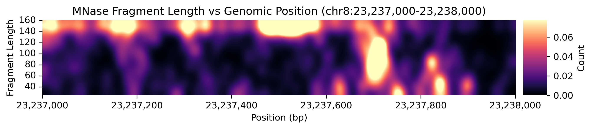

# MNase Footprint Tools

This toolkit provides tools for analyzing and modeling DNA footprints from Micro-C and Region Capture Micro-C (RCMC) data. It includes utilities for preprocessing BAMs, visualizing footprints, and building predictive models that connect chromatin accessibility patterns to transcription initiation (PRO-Cap) signals.

## Footprint preprocessing

These steps preprocess Micro-C data (in BAM format) to fragment counts. Counts are binned by fragment length and position (mid-point).

### Step 0: Setup

#### Create a virtual environment
```bash
# Install dependencies for preprocessing and visualization
conda env create -f footprint-tools-env.yaml
```

#### Download a genome
```bash
mkdir genome && cd genome
# Download the GRCh38 FASTA
wget ftp://ftp.ebi.ac.uk/pub/databases/gencode/Gencode_human/release_45/GRCh38.primary_assembly.genome.fa.gz

# Decompress it
gunzip GRCh38.primary_assembly.genome.fa.gz

# 3. Re-compress with BGZF
bgzip -@ 4 GRCh38.primary_assembly.genome.fa

# Index it with samtools (creates .fai file)
samtools faidx GRCh38.primary_assembly.genome.fa.gz
```

### Step 1: Read pairs (bam) to fragment pairs (.pairs)
```bash
conda activate footprint-tools

SAMPLE="test_data/mesc_microc_test"
#SAMPLE="/aryeelab/users/corri/data/Hansen_RCMC/MicroC_3hrDMSO"
#SAMPLE="data/MicroC_3hrDMSO"

min_mapq=20
chrom_sizes=test_data/mm10.chrom.sizes

samtools view -h ${SAMPLE}.bam | \
pairtools parse --min-mapq ${min_mapq} --walks-policy 5unique --drop-sam \
    --max-inter-align-gap 30 --add-columns pos5,pos3 \
    --chroms-path ${chrom_sizes} | \
pairtools sort | \
pairtools dedup -o ${SAMPLE}.pairs
```

### Step 2: Fragment pairs (.pairs.gz) to fragment counts by position and length (.counts.tsv.gz)

The `pairs_to_fragment_counts.py` script provides an automated pipeline that converts genomic pairs files into tabix-indexed fragment count matrices for downstream footprint analysis. Processing includes:
(1) convert pairs to individual fragments using midpoint position and length (instead of fragment start, end)
(2) sort fragments by chromosome, position, and length
(3) count unique fragment chrom, pos, lengthcombinations to create a sparse count matrix
(4) compress the output using bgzip and create a tabix index for fast random access
(5) clean up intermediate files to conserve disk space. 


```bash
# Computes a 2D histogram (stored as a sparse matrix) of fragment counts per position by length bin
# Output is a TSV of chrom \t pos \t fragment_length \t count
# This file is bgzip compressed and tabix indexed

python code/pairs_to_fragment_counts.py ${SAMPLE}.pairs.gz -o ${SAMPLE}.counts.tsv.gz

```

## Detecting footprints

The footprint detection pipeline uses a blob detection algorithm:
1. Normalizes counts by the average
2. Applies 2D Gaussian smoothing to the normalized counts matrix (fragment_length x pos)
3. Creates a binary mask of regions above the threshold value
4. Uses a watershed algorithm to separate adjacent blobs
5. Calculates properties for each blob:
   - Peak position (fragment_length, basepair_position)
   - Size (number of pixels)
   - Maximum signal intensity
   - Mean signal intensity
   - Total signal (sum of all intensity values)

The `detect_footprints.py` script provides a command line interface for footprint detection with statistical significance testing:

```bash

# Basic usage: Process all chromosomes
python code/detect_footprints.py -i test_data/mesc_microc_test.counts.tsv.gz -o footprints.tsv

```

**Output format:**
The script outputs footprints in a TSV file with the following columns:
- `chrom`: Chromosome name
- `position`: Genomic position of footprint peak
- `fragment_length`: Fragment length at peak intensity
- `size`: Size of footprint in pixels (rounded to 1 decimal place)
- `max_signal`: Maximum signal intensity (rounded to 1 decimal place)
- `mean_signal`: Average signal intensity (rounded to 1 decimal place)
- `total_signal`: Total signal (sum of intensities, rounded to 1 decimal place)
- `p_value`: Statistical significance (full precision, if calculated)
- `q_value`: FDR-corrected p-value (full precision, if calculated)

For interactive analysis and visualization, see `footprinting.ipynb`.

## Visualizing footprints

After preprocessing reads as above, the smooothed counts and detected footprints can be visualized. 

```python
from footprinting import get_count_matrix, plot_count_matrix

counts_gz = 'test_data/mesc_microc_test.counts.tsv.gz'
chrom = 'chr8'
start_bp = 23_237_000
end_bp = 23_238_000

count_mat, _ = get_count_matrix(counts_gz, chrom, start_bp, end_bp, 
                                fragment_len_min=25, fragment_len_max=160, sigma=10)

plot_count_matrix(count_mat, xtick_spacing=200, figsize=(10, 1.5))
```



*Example footprint visualization showing MNase fragment length vs genomic position. The heatmap displays fragment count intensity across different fragment lengths (y-axis) and genomic coordinates (x-axis). Darker regions indicate higher fragment counts, with nucleosomes at the ~150bp length and TFs at the <80bp length.*

```bash
# See footprinting.ipynb for examples
```

## Detecting footprints - Advanced usage examples

```
# View all options
python code/detect_footprints.py -h

# Process specific chromosomes
python code/detect_footprints.py -i test_data/mesc_microc_test.counts.tsv.gz -o footprints.tsv -r chr8

# Process specific genomic regions
python code/detect_footprints.py -i test_data/mesc_microc_test.counts.tsv.gz -o footprints.tsv -r chr8:22000000-23000000

# Adjust detection parameters
python code/detect_footprints.py -i test_data/mesc_microc_test.counts.tsv.gz -o footprints.tsv -r chr8 \
    --threshold 15.0 --sigma 2.0 --min-size 10 --num-cores 4

# Custom memory limit and batch size
python code/detect_footprints.py -i data/large_dataset.counts.tsv.gz -o footprints.tsv \
    --max-memory-gb 16 --batch-size 1000 --num-cores 6

# Use stricter 5% FDR threshold (default is 10% FDR)
python code/detect_footprints.py -i test_data/mesc_microc_test.counts.tsv.gz -o footprints.tsv -r chr8 \
    --qcutoff 0.05

# Enable detailed timing and performance statistics
python code/detect_footprints.py -i test_data/mesc_microc_test.counts.tsv.gz -o footprints.tsv -r chr8 \
    --timing
```

## Unit tests

To run the test suite:
```bash
# Activate the footprint-tools environment
conda activate footprint-tools

# Run all tests
cd tests
python3 run_tests.py
```

See the [tests/README.md](tests/README.md) file for more information on running and adding tests.


## Exploratory predictive modeling of footprints -> PRO-Cap signal

We are exploring building machine learning models to predict transcription initiation (PRO-Cap) signals from chromatin accessibility footprints. [VERY EXPERIMENTAL!]

### Install dependencies (within a virtual environment)
```bash
# Install dependencies for modeling
pip install torch pytorch-lightning
pip install pandas numpy matplotlib seaborn
pip install wandb
pip install pysam pyBigWig bioframe biopython
pip install scikit-learn scikit-image
```

### Run the notebook
```bash
See footprinting-to-procap.ipynb for examples
```


