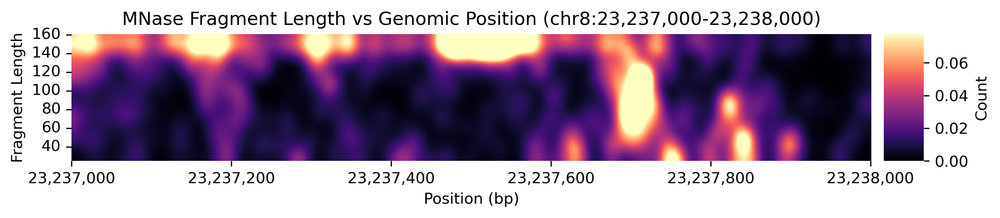

# FOCI-3D

FOCI-3D (Footprinting Of Chromatin Interactions in 3D) is a toolkit for analyzing transcription factor footprints from Micro-C, Region Capture Micro-C (RCMC) and related MNase-based chromosome conformation capture assays. The supported workflow is:

1. Generate a `.pairs` file containing ligation fragment start and end positions from a BAM.
2. Compute a fragment midpoint x fragment length 2D histogram of fragment counts
3. Visualize 2D footprint heatmaps using either the command line or from Python.

We're currently developing methodology to detect statistically significant footprints and perform differential testing across conditions. Please reach out if interested in discussing: martin.aryee@ds.dfci.harvard.edu.


## Install

```bash
conda install -c conda-forge -c bioconda foci-3d
```

This installs the Python package together with the external bioinformatics tools required for the core workflow, including `samtools`, `pairtools`, `bgzip` and `tabix`.

## Quickstart

### 1. Parsing pairs from a BAM

Create a deduplicated `.pairs` file from a BAM:

```bash
foci-3d parse tests/data/mesc_microc_test.bam -o test.pairs
```

`foci-3d parse` is a simple wrapper around `pairtools parse` with reasonable defaults for this workflow.

Note: If you do not pass `--chroms-path`, it generates a temporary chrom sizes file from the BAM header automatically.

### 2. Count fragments

Make a 2D histogram where each fragment is represented by (fragment midpoint, fragment length). The matrix is bgzip-compressed and tabix-indexed.

```bash
foci-3d count test.pairs -o test.counts.tsv.gz
```

### 3. Plot footprints

Render a heatmap image for a genomic interval:

```bash
foci-3d plot \
  -i test.counts.tsv.gz \
  -o test.png \
  -r chr8:23237000-23238000
```

Example: Plotting multiple samples and adding a gene annotation track:

```bash
foci-3d plot \
  -i test-dmso.counts.tsv.gz \
  -i test-kd.counts.tsv.gz \
  --track-title DMSO \
  --track-title KD \
  -o test_vs_dmso.png \
  -r chr8:23237000-23238000 \
  --gene-track gencode.v49.basic.annotation.gtf.gz \
  --title "Gene X promoter"
```

By default, multi-panel plots use `--norm nucleosome-median`, which rescales each panel to match the reference panel at the median signal of its peak fragment-length row. `--norm nucleosome-mean` uses the mean instead, and `--norm none` disables panel-to-panel normalization.

Figure sizing now uses the final output dimensions. `--fig-width` sets the final figure width in inches, `--fig-height` sets the final figure height in inches, and if `--fig-height` is omitted it defaults to half of the final width. If `--fig-width` is omitted, the default width is derived from `--aspect-ratio` using the legacy 1.5-inch panel height.

Plot text now uses a larger default base size, and you can adjust it with `--font-size`.

See `foci-3d plot --help` for complete options.

Example: Plot a region while keeping only anchor fragments whose partner fragment midpoint falls in a second interval:

```bash
foci-3d plot \
  -i test.counts.tsv.gz \
  --pairs test.pairs.gz \
  -o test_partner_filtered.png \
  -r chr8:23237000-23238000 \
  --partner-region chr8:23237500-23238500
```

Optional labels can be attached to partner regions and will be used in panel titles:

```bash
foci-3d plot \
  -i test.counts.tsv.gz \
  --pairs test.pairs.gz \
  -o test_partner_labeled.png \
  -r chr8:23237000-23238000 \
  --partner-region E1=chr8:23237500-23238500
```

For multi-sample partner-filtered plots, repeat `--pairs` once per `--input`, in the same order:

```bash
foci-3d plot \
  -i test-dmso.counts.tsv.gz \
  -i test-kd.counts.tsv.gz \
  --pairs test-dmso.pairs.gz \
  --pairs test-kd.pairs.gz \
  --track-title DMSO \
  --track-title KD \
  -o test_partner_multi.png \
  -r chr8:23237000-23238000 \
  --partner-region E1=chr8:23237500-23238500 \
  --partner-region E2=chr8:23239000-23240000
```

Partner-region semantics:

- The heatmap counts anchor fragments whose midpoints fall in `--region`.
- The partner filter is applied to the partner fragment midpoint in `--partner-region`.
- One pair may contribute two observations if both ends satisfy the anchor rule.
- Labels in `NAME=chr:start-end` are display-only aliases used in panel titles.
- Partner-region plots include an `All fragments` panel first, and `--norm nucleosome-median` or `--norm nucleosome-mean` normalizes each partner-restricted panel to that reference for the same track.

### 4. Summarize fragment-length QC across samples

Generate a fragment-length distribution plot and summary metrics directly from one or more `counts.tsv.gz` files:

```bash
foci-3d qc \
  sample1.counts.tsv.gz \
  sample2.counts.tsv.gz \
  --region-bed targets.bed \
  -o results/my_qc
```

This writes:

- `results/my_qc_foci_fragment_length_dist.png`
- `results/my_qc_foci_fragment_metrics.tsv`

By default, `foci-3d qc` estimates these summaries from sampled genomic windows to stay practical on large inputs:

- `--sample-windows 1000`
- `--window-size-bp 10000`
- `--seed 123`

Use `--sample-windows all` to disable sampling and scan the full analysis domain exactly. If `--region-bed` is omitted, the command uses the span covered by the observed records in each counts file. If `--sample-name` is omitted, sample names are inferred from `SAMPLE_NAME.counts.tsv.gz`.

The metrics table reports:

- genomic span and number of windows analyzed
- number and percent of fragments `<=80 bp`
- fraction of zero windows for fragments `<=80 bp`
- median nonzero fragment density per kb for fragments `<=80 bp`

See `foci-3d qc --help` for complete options.


#### Gene annotation tracks
Gene annotation can be in GTF, GFF3, or BED12 format. For human `hg38`, two useful starting points are:

- GENCODE Basic annotation (recommended default): official release page at
  `https://www.gencodegenes.org/human/`
- UCSC `ncbiRefSeq` annotation: download directory at
  `https://hgdownload.soe.ucsc.edu/goldenPath/hg38/bigZips/genes/`

Example download commands:

```bash
curl -L --fail \
  -o gencode.v49.basic.annotation.gtf.gz \
  ftp://ftp.ebi.ac.uk/pub/databases/gencode/Gencode_human/release_49/gencode.v49.basic.annotation.gtf.gz

curl -L --fail \
  -o hg38.ncbiRefSeq.gtf.gz \
  https://hgdownload.soe.ucsc.edu/goldenPath/hg38/bigZips/genes/hg38.ncbiRefSeq.gtf.gz
```


## Python API

```python
from foci3d import get_count_matrix, plot_count_matrix

counts_gz = "test.counts.tsv.gz"
chrom = "chr8"
start_bp = 23_237_000
end_bp = 23_238_000

count_mat, _ = get_count_matrix(
    counts_gz,
    chrom,
    start_bp,
    end_bp,
    fragment_len_min=25,
    fragment_len_max=160,
    sigma=10,
)

plot_count_matrix(count_mat, xtick_spacing=200, figsize=(10, 1.5))
```



## Command Help

```bash
foci-3d --help
foci-3d parse --help
foci-3d count --help
foci-3d plot --help
foci-3d qc --help
```

### Parsing pairs: If you want more control

If you'd like to run `pairtools parse` yourself (instead of using the simplified `foci-3d parse` wrapper), you can do something like:

```bash
samtools view -h tests/data/mesc_microc_test.bam | \
pairtools parse --min-mapq 30 --walks-policy 5unique --drop-sam \
  --max-inter-align-gap 30 --add-columns pos5,pos3 \
  --chroms-path tests/data/mm10.chrom.sizes | \
pairtools sort | \
pairtools dedup -o test.pairs
```

Important points:

`-add-columns pos5,pos3` is needed to allow fragment length calculation. The default output includes only one coordinate per fragment as this is all that is needed for a contact map.

The alignments from the same pair (i.e. those with the same READ ID) need to appear next to each other. Samtools name sorting achieves this, as does output directly from bwa (without coordinate sorting).

## Advanced Manual BAM-to-pairs Workflow

If you want to run the underlying tools manually, the equivalent workflow is:

```bash
samtools view -h tests/data/mesc_microc_test.bam | \
pairtools parse --min-mapq 30 --walks-policy 5unique --drop-sam \
  --max-inter-align-gap 30 --add-columns pos5,pos3 \
  --chroms-path tests/data/mm10.chrom.sizes | \
pairtools sort | \
pairtools dedup -o test.pairs
```

The development repository lives at [aryeelab/foci-3d](https://github.com/aryeelab/foci-3d).

## Development

For development work clone the repository and set up a conda environment:

```bash
git clone https://github.com/aryeelab/foci-3d.git
cd foci-3d
conda env create -f environment.yml # This will create the foci-3d env
conda activate foci-3d
pip install -e .
python tests/run_tests.py
foci-3d -h
```

## Normalization Choices

FOCI-3D supports three normalization modes when rendering footprint heatmaps:

```bash
--scale no
--scale by_fragment_length
--scale yes
```

### Scale Factor Calculation

Fragment-length scale factors are computed and stored in the header of the resulting `counts.tsv.gz` file.

For each chromosome, genomic positions are grouped into **valid segments**. Positions separated by gaps larger than 5 kb are treated as belonging to different segments (`gap_thresh=5000`). The total number of valid bases is calculated as the sum of segment lengths across all valid segments.

For each fragment length, counts are summed across all valid positions. The chromosome-specific scale factor is then calculated as:

```text
scale_factor(fragment_length) = total_count(fragment_length) / total_valid_bases
```

This quantity can be interpreted as the **average count per valid base for a given fragment length**.

The final scale factor for each fragment length is obtained by averaging chromosome-specific values across chromosomes.

#### `--scale no`

No fragment-length normalization is applied.

This mode uses the raw count matrix + Gaussian smoothing.

#### `--scale by_fragment_length`

Each fragment length is normalized using its own scale factor.

```text
output(fragment_length) = count(fragment_length) / scale_factor(fragment_length)
```
This mode performs fragment-length-specific normalization.

#### `--scale yes`

This mode applies a simplified fragment-length normalization strategy.

First, the most common fragment length is identified as the fragment length with the largest scale factor.   
All fragment lengths shorter than this value are normalized using the average scale factor across all shorter fragment lengths. Fragment lengths equal to or greater than the most common fragment length are normalized using the scale factor of the most common fragment length itself.

This approach provides a compromise between no normalization and full fragment-length-specific normalization.

> **Note**
>
> All normalization modes are sample-specific.  
> The most common fragment length is determined independently for each sample, so the threshold used by `--scale yes` may differ between samples.
> 
